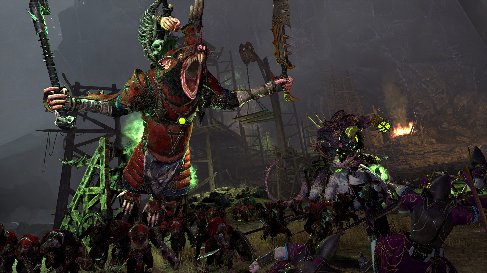

# Agent Base Model
 <br>
 <br>


## 1. Content list
This model is created to monitor wolves' hunt sheep events. It simulates wolves chasing the sheep, catching it, and eating it. This model contains four files: GIS.py, agentframework.py agentwolf.py, and in1.txt.

- GIS.py contains code for creating sheep and wolf lists, fetching table from a website which used to generate sheep and wolves location, creating a model background using data from in1.txt, wolves catching sheep function,  and creating a canvas and a menu which animates the wolves' hunt sheep event. 

- agentframework.py contains code of class `Agent` which represents sheep. It includes moving, eating, and sharing information with neighborhood functions, and code`self.alive=True` which is used to simulate whether sheep are hunted or not. If sheep are alive, then sheep can move: 
```python
        if(self.alive):
           self.x=self.move_coordinate(self.x,d)
           self.y=self.move_coordinate(self.y,d)
``` 
if the sheep are hunted, then the sheep will be dead and stop moving with the color red: 
```python
         agents.alive=False
         agents.color='Red'. 
```


- agentwolf.py contains code of class `Wolf` which represents wolves. It only includes the move function, but the wolves can move faster than sheep. Because in sheep:
    
 ```python 
       def move_coordinate(self,a,d):
     
          if random.random()<0.33:
              return a
          elif random.random()<0.5:
              a=(a+random.randint(1,d))%100
          else:
              a=(a-random.randint(1,d))%100
          return a 
```
   the value of d is `d = 3 `, while in wolf:
  ```python
        def move_coordinate(self,a,v):
       
          if random.random()<0.33:
              return a
          elif random.random()<0.5:
              a=(a+random.randint(4,v))%100
          else:
              a=(a-random.randint(4,v))%100
          return a
```
   the value v is `v = 50`, so wolves has a high possibility to move faster than sheep. 

- in1.txt contains raster data, each value represtents a pixel, so all the data can form a environment background. 

## 2. How to run
This model runs in python, after clicking `run file`, it will pop up a menu. And click `Model` in the menu bar, click `Run model` the model will start to run. Sheep will move randomly and wolves will move faster. There will be 3 wolves with random colors **black, green** and **blue**, and all the sheep(40) are **white**. Wolves and sheep are set to move 50 times. If sheep are within the 30 unit range of wolves, the sheep would be caught and die. This is a **[screen shot](hunting.png)** of the model showing 3 dead sheep. If the model keeps running, then all the sheep are supposed to die.

## 3. Tests
To ensure the model has no significant error or flaw, several tests were conducted: url drag tests, envronment background tests, catch function tests, update function tests.

## 4. Issues
The model has a bug which is in the hunting part. All the sheep will be hunted and die according to the code, but no matter setting how many iterations, only three sheep will die. Though the record in the console shows multiple kills, the animation only shows three dead sheep. To tackle the problem, another code to determine the sheep is dead was added:
```python
        def move_coordinate(self,a,d):
          if self.color != 'Red':
            if random.random()<0.33:
               return a
```
sheep will only move if the color is not red. However, the problem still exists.

## 5. License
[MIT © Yuming Zhang](LICENSE)


